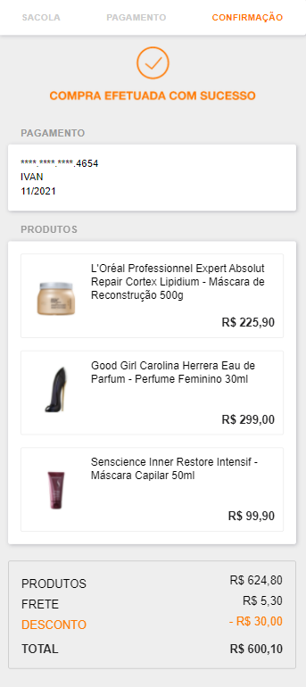

# Simple checkout process


## Screenshots

<div align="center">
  
  
  
  </div>

## Technologies

This project was made using the follow technologies:

- [React](https://reactjs.org/)
- [Jest](https://jestjs.io/pt-BR/)
- [React Testing Library](https://testing-library.com/docs/react-testing-library/intro/)
- [Prettier](https://prettier.io/)
- [Styled Components](https://styled-components.com/)

## Getting started

```bash
# Clone Repository
$ git clone git@github.com:niltonxp2/simple-checkout.git && cd test-front

# Install Dependencies
$ yarn or npm i

# Run Aplication
$ yarn start or npm start
```

Go to http://localhost:3000/ to see the application running.

## Running tests

```bash
$ yarn test

# Run with --coverage to generate a new coverage report
$ yarn coverage
```

## Contributing

- Fork this repository;
- Create a new branch to develop your feature: `git checkout -b my-feature`;
- Commit your changes: `git commit -m 'feat: my new feature'`;
- Push to your branch: `git push origin my-feature`.

Made with 💖 by [Ivanilton Bezerra](https://www.linkedin.com/in/ivanilton-bezerra-da-silva-b67784108/). 

